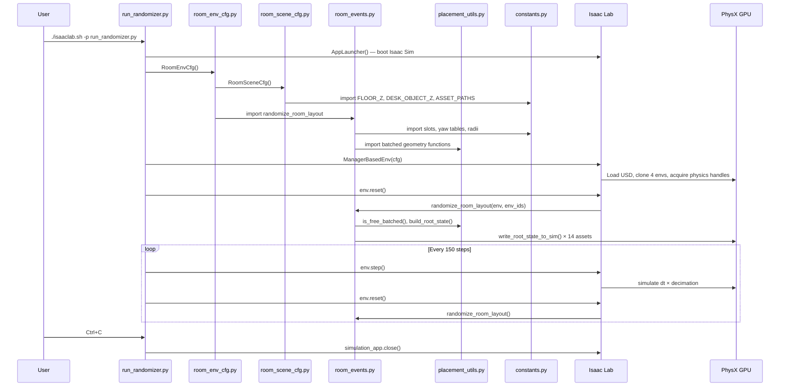

# Execution Flow: Moment by Moment

This traces **exactly** what happens, in order, when you type the command and press Enter.

---

## Moment 0: You type the command

```bash
./isaaclab.sh -p /Users/cezarioa/Documents/room_randomizer_lab/run_randomizer.py --num_envs 4
```

The `isaaclab.sh` wrapper activates the correct Python environment (with Omniverse + PhysX + torch + isaaclab all pre-loaded), then calls `python run_randomizer.py --num_envs 4`.

---

## Moment 1: Isaac Sim boots up

**File:** [run_randomizer.py](file:///Users/cezarioa/Documents/room_randomizer_lab/run_randomizer.py) — lines 5–16

```python
from isaaclab.app import AppLauncher

parser = argparse.ArgumentParser(...)
parser.add_argument("--num_envs", type=int, default=4, ...)
AppLauncher.add_app_launcher_args(parser)
args_cli = parser.parse_args()

app_launcher = AppLauncher(args_cli)       # ← THIS BOOTS ISAAC SIM
simulation_app = app_launcher.app
```

**What happens:**
- `AppLauncher(args_cli)` starts the full Omniverse Kit / Isaac Sim runtime.
- A viewer window appears on your screen (black at first).
- The physics engine (PhysX) initializes on the GPU.
- This takes ~10–30 seconds depending on your hardware.

> [!IMPORTANT]
> Nothing else can be imported until this completes. That's why `import torch` and all isaaclab imports come **after** line 16.

---

## Moment 2: Configuration objects are created

**File:** [run_randomizer.py](file:///Users/cezarioa/Documents/room_randomizer_lab/run_randomizer.py) — lines 46–53

```python
env_cfg = RoomEnvCfg()
env_cfg.scene.num_envs = args_cli.num_envs   # overrides default 20 → 4
env_cfg.actions = DummyActionsCfg()
env_cfg.observations = DummyObservationsCfg()
```

**What happens:**
- Python instantiates `RoomEnvCfg` from [room_env_cfg.py](file:///Users/cezarioa/Documents/room_randomizer_lab/room_env_cfg.py).
- `__post_init__` runs, setting `dt = 1/120`, `decimation = 2`.
- Inside it, `RoomSceneCfg` from [room_scene_cfg.py](file:///Users/cezarioa/Documents/room_randomizer_lab/room_scene_cfg.py) is instantiated with all 16 asset fields (ground, light, room_shell, desk, chair, ridgeback, 8 wall props, 3 tabletop objects).
- `RoomEventCfg` is instantiated, registering the `randomize_room_layout` function from [room_events.py](file:///Users/cezarioa/Documents/room_randomizer_lab/room_events.py) with `mode="reset"`.
- **No USD is loaded yet.** These are just Python dataclass objects describing *what* to build.

---

## Moment 3: The environment is constructed

**File:** [run_randomizer.py](file:///Users/cezarioa/Documents/room_randomizer_lab/run_randomizer.py) — line 57

```python
env = ManagerBasedEnv(cfg=env_cfg)
```

This single line triggers an enormous amount of work. Here's what happens inside Isaac Lab:

### 3a. Scene construction — USD stage is built

Isaac Lab reads `RoomSceneCfg` and processes each field **in declaration order**:

| Order | Field | What Isaac Lab does |
|---|---|---|
| 1 | `ground` | Creates `/World/ground`, spawns a flat GroundPlane primitive |
| 2 | `dome_light` | Creates `/World/light`, spawns a dome light at intensity 3000 |
| 3 | `room_shell` | **Loads `new_base_room.usda`** → creates prim at `/World/envs/env_0/RoomShell`. The entire room (walls, floor, ceiling, **all props inside**) appears in the viewer |
| 4 | `desk` | `spawn=None` → does NOT create anything. Instead, Isaac Lab **finds** the existing prim at `/World/envs/env_0/RoomShell/props/room_props/SM_Desk_04a` (which was already loaded as part of the room shell) and registers it as a controllable `RigidObject` |
| 5 | `chair` | Same — finds existing `SM_Chair_04a` inside the room shell |
| 6 | `ridgeback` | Same — finds existing `ridgeback_03` inside the room shell |
| 7–14 | 8 wall props | Same — finds each existing wall prop prim inside the room shell |
| 15–17 | 3 tabletop objects | Same — finds `SM_CoffeeToGo`, `SM_Lamp02`, `SM_BoxPortableC` inside the desk subtree |

### 3b. Environment cloning — 4 copies are made

Isaac Lab sees `num_envs=4` and `env_spacing=16.0`. It:

1. Takes everything under `/World/envs/env_0/` (the room shell + all registered objects).
2. Clones it 3 more times → `/World/envs/env_1/`, `env_2/`, `env_3/`.
3. Arranges them in a 2×2 grid, spaced 16 meters apart.
4. Records each environment's world-space origin in `env.scene.env_origins` → a `(4, 3)` tensor.

**In the viewer, you now see 4 identical hospital rooms arranged in a grid.**

### 3c. Physics handles are acquired

For each `RigidObjectCfg` field (desk, chair, ridgeback, 8 wall props, 3 tabletop objects), Isaac Lab:

1. Finds the USD prim across all 4 environments.
2. Acquires a **PhysX rigid body handle** for each one → this is the GPU-side physics pointer that allows `write_root_state_to_sim` to work.
3. Reads the `default_root_state` (position + orientation + velocities) from the current USD transforms.

> [!WARNING]
> If any prim does NOT have the `RigidBodyAPI` applied (the step you need to do in Isaac Sim first), this is where you'd get an error like `RuntimeError: Failed to find a rigid body when resolving...`.

### 3d. Event manager is initialized

Isaac Lab reads `RoomEventCfg` and registers:
- `randomize_room_layout` as a reset-mode event term.
- It stores the `params` dict (`wall_prop_names`, `table_prop_names`, `min_table_objects`).

---

## Moment 4: First reset — randomization fires!

**File:** [run_randomizer.py](file:///Users/cezarioa/Documents/room_randomizer_lab/run_randomizer.py) — line 69

```python
env.reset()
```

Inside `env.reset()`, Isaac Lab calls every event term registered with `mode="reset"`. That means it calls:

**File:** [room_events.py](file:///Users/cezarioa/Documents/room_randomizer_lab/room_events.py) — `randomize_room_layout()`

```python
randomize_room_layout(
    env=env,
    env_ids=torch.tensor([0, 1, 2, 3]),   # all 4 envs reset
    wall_prop_names=["medical_cabinet", "shelf_set", ...],
    table_prop_names=["coffee_cup", "desk_lamp", "box_portable"],
    min_table_objects=2,
)
```

### 4a. Phase 1: Wall props are shuffled (`_place_wall_props`)

For each of the 8 wall props, across all 4 environments:

1. Shuffles the 10 wall slots randomly.
2. For each env, tries slots until one passes:
   - Room bounds check ✓
   - Corner clearance for tall props ✓
   - Circle-packing overlap check ✓
3. Computes the yaw from `WALL_PROP_YAW_BY_WALL` lookup.
4. Calls `build_root_state()` from [placement_utils.py](file:///Users/cezarioa/Documents/room_randomizer_lab/placement_utils.py) to construct a `(4, 13)` tensor (position + quaternion + velocities).
5. Calls `asset.write_root_state_to_sim(root_state, env_ids=env_ids)`.

**→ The GPU physics engine instantly teleports each wall prop to its new position in all 4 rooms simultaneously.**

Props that don't fit any slot get moved to `z = -100` (underground, invisible).

### 4b. Phase 2: Table group is placed (`_place_table_group`)

1. Tries pre-approved room slots with random yaw (up to 24 yaw samples per slot).
2. For each proposed desk position, computes chair + robot positions via `offset_from_yaw_batched()`.
3. Checks all 3 fit inside room bounds AND don't overlap wall props using `table_group_fits_batched()`.
4. Falls back to random `(x, y, yaw)` sampling, then to the room center.
5. Calls `write_root_state_to_sim` for desk, chair, and ridgeback.

**→ The desk, chair, and ridgeback teleport to new positions. The chair faces the desk. The robot is beside the desk.**

### 4c. Phase 3: Desk objects are scattered (`_place_desk_objects`)

1. Randomly decides to show 2 or 3 objects per env.
2. For each object, rejection-samples a local `(x, y)` on the desk surface.
3. Transforms local coordinates to world coordinates using the desk's position and yaw.
4. Objects not selected get moved underground (`z = -100`).
5. Calls `write_root_state_to_sim` for coffee_cup, desk_lamp, box_portable.

**→ 2–3 small objects appear on each desk in different positions.**

**At this point, the viewer shows 4 hospital rooms, each with a unique random layout.**

---

## Moment 5: Simulation steps forward

**File:** [run_randomizer.py](file:///Users/cezarioa/Documents/room_randomizer_lab/run_randomizer.py) — line 72

```python
env.step(action=torch.empty(env.num_envs, 0, device=env.device))
```

Each call to `env.step()`:

1. Applies actions (empty in our case — no robot control yet).
2. Steps PhysX by `dt × decimation` = `(1/120) × 2` = 0.0167 seconds of sim time.
3. Dynamic objects (coffee cup, lamp, box) are affected by gravity — they settle onto the desk surface.
4. Kinematic objects (desk, wall props, ridgeback) stay exactly where the event term placed them.
5. Updates all physics state tensors on the GPU.

This repeats 150 times (~1.25 seconds of sim time), then...

---

## Moment 6: Reset fires again (step 150)

```python
if step_count % reset_interval == 0:
    env.reset()   # → randomize_room_layout fires again
```

**→ All furniture instantly teleports to a brand new random layout. The viewer shows the rooms "snap" into a new configuration.**

This loop continues indefinitely: 150 steps of physics → reset → new layout → 150 steps → reset → ...

---

## Moment 7: You press Ctrl+C

```python
except KeyboardInterrupt:
    print("Simulation stopped by user.")
finally:
    simulation_app.close()    # cleanly shuts down Isaac Sim
```

---

## Summary: File execution order


