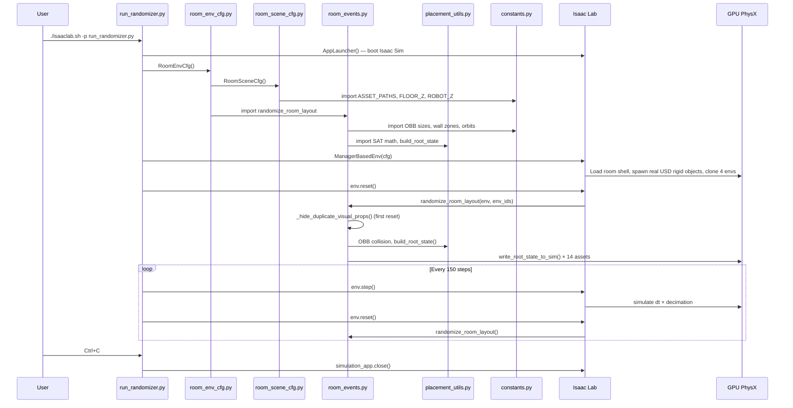

# Execution Flow: Moment by Moment

This traces **exactly** what happens, in order, when you type the command and press Enter.

---

## Moment 0: You type the command

```bash
./isaaclab.sh -p /path/to/room_randomizer_lab/run_randomizer.py --num_envs 4
```

The `isaaclab.sh` wrapper activates the correct Python environment (with Omniverse + PhysX + torch + isaaclab all pre-loaded), then calls `python run_randomizer.py --num_envs 4`.

---

## Moment 1: Isaac Sim boots up

**File:** [run_randomizer.py](file:///Users/cezarioa/Projects/isaac-projects/room_randomizer_lab/run_randomizer.py) — lines 6–26

```python
from isaaclab.app import AppLauncher

parser = argparse.ArgumentParser(...)
parser.add_argument("--num_envs", type=int, default=4, ...)
parser.add_argument("--save_camera", action="store_true", ...)
AppLauncher.add_app_launcher_args(parser)
args_cli = parser.parse_args()

app_launcher = AppLauncher(args_cli)       # ← THIS BOOTS ISAAC SIM
simulation_app = app_launcher.app
```

**What happens:**
- `AppLauncher(args_cli)` starts the full Omniverse Kit / Isaac Sim runtime.
- A viewer window appears on your screen (black at first).
- The physics engine (PhysX) initializes.
- This takes ~10–30 seconds depending on your hardware.

> [!IMPORTANT]
> Nothing else can be imported until this completes. That's why `import torch` and all isaaclab imports come **after** the `AppLauncher` call.

---

## Moment 2: Configuration objects are created

**File:** [run_randomizer.py](file:///Users/cezarioa/Projects/isaac-projects/room_randomizer_lab/run_randomizer.py) — lines 84–91

```python
env_cfg = RoomEnvCfg()
env_cfg.scene.num_envs = args_cli.num_envs   # overrides default 20 → 4
env_cfg.actions = DummyActionsCfg()
env_cfg.observations = DummyObservationsCfg()
```

**What happens:**
- Python instantiates `RoomEnvCfg` from [room_env_cfg.py](file:///Users/cezarioa/Projects/isaac-projects/room_randomizer_lab/room_env_cfg.py).
- `__post_init__` runs, setting:
  - `dt = 1/120`, `decimation = 2`
  - `sim.device = "cuda:0"` (GPU PhysX)
  - `sim.use_fabric = True` (Fabric scene representation for GPU performance)
- Inside it, `RoomSceneCfg` from [room_scene_cfg.py](file:///Users/cezarioa/Projects/isaac-projects/room_randomizer_lab/room_scene_cfg.py) is instantiated with all 18 asset fields (ground, light, room shell, 3 table-group objects, 8 wall props, 3 tabletop objects, 1 camera).
- `RoomEventCfg` is instantiated, registering `randomize_room_layout` from [room_events.py](file:///Users/cezarioa/Projects/isaac-projects/room_randomizer_lab/room_events.py) with `mode="reset"` and all 8 wall prop names + 3 tabletop object names.
- **No USD is loaded yet.** These are just Python dataclass objects describing *what* to build.

---

## Moment 3: The environment is constructed

**File:** [run_randomizer.py](file:///Users/cezarioa/Projects/isaac-projects/room_randomizer_lab/run_randomizer.py) — line 95

```python
env = ManagerBasedEnv(cfg=env_cfg)
```

This single line triggers an enormous amount of work. Here's what happens inside Isaac Lab:

### 3a. Scene construction — USD stage is built

Isaac Lab reads `RoomSceneCfg` and processes each field **in declaration order**:

| Order | Field | What Isaac Lab does |
|---|---|---|
| 1 | `ground` | Creates `/World/ground`, spawns a flat GroundPlane primitive |
| 2 | `dome_light` | Creates `/World/light`, spawns a dome light at intensity 3000 |
| 3 | `room_shell` | **Loads `new_base_room.usda`** → creates prim at `{ENV}/RoomShell`. The room (walls, floor, ceiling, visual props) appears in the viewer |
| 4 | `desk` | **Loads SM_Desk_04a.usd** from Omniverse CDN via `_spawn_real_rigid_usd()`. Creates a kinematic rigid body at `{ENV}/Desk` |
| 5 | `chair` | **Loads SM_Chair_04a.usd** → kinematic rigid body at `{ENV}/Chair` |
| 6 | `ridgeback` | **Loads ridgeback_ur5.usd** → articulation at `{ENV}/Ridgeback` |
| 7–14 | 8 wall props | Each loads its USD from CDN via `_spawn_real_rigid_usd()` → kinematic rigid bodies |
| 15–17 | 3 tabletop objects | Coffee cup, desk lamp, portable box → kinematic rigid bodies on the desk |
| 18 | `top_down_camera` | Pinhole camera for debugging/image capture |

> [!NOTE]
> **Real USD architecture:** Each furniture prop is the **actual detailed mesh** loaded from the Omniverse CDN. The `_spawn_real_rigid_usd()` function strips any nested rigid body APIs from imported children and authors a single root `RigidBodyAPI` so Isaac Lab's tensor views work correctly. Mesh colliders are auto-added if none exist.

### 3b. Environment cloning — 4 copies are made

Isaac Lab sees `num_envs=4` and `env_spacing=16.0`. It:

1. Takes everything under `/World/envs/env_0/` (the room shell + all rigid bodies).
2. Clones it 3 more times → `/World/envs/env_1/`, `env_2/`, `env_3/`.
3. Arranges them in a 2×2 grid, spaced 16 meters apart.
4. Records each environment's world-space origin in `env.scene.env_origins` → a `(4, 3)` tensor.

**In the viewer, you now see 4 identical hospital rooms arranged in a grid.**

### 3c. Physics handles are acquired

For each `RigidObjectCfg` field (desk, chair, 8 wall props, 3 tabletop objects), Isaac Lab:

1. Finds the rigid body prim across all 4 environments.
2. Acquires a **PhysX rigid body handle** — this is the GPU-side physics pointer that allows `write_root_state_to_sim` to work.
3. Reads the `default_root_state` (position + orientation + velocities) from the current transforms.

For the `ArticulationCfg` (ridgeback), Isaac Lab acquires an articulation handle instead.

### 3d. Event manager is initialized

Isaac Lab reads `RoomEventCfg` and registers:
- `randomize_room_layout` as a reset-mode event term.
- It stores the `params` dict: `wall_prop_names` (8 names), `table_prop_names` (3 names: coffee_cup, desk_lamp, box_portable), `min_table_objects` (2).

---

## Moment 4: First reset — randomization fires!

**File:** [run_randomizer.py](file:///Users/cezarioa/Projects/isaac-projects/room_randomizer_lab/run_randomizer.py) — line 116

```python
env.reset()
```

Inside `env.reset()`, Isaac Lab calls every event term registered with `mode="reset"`. That means it calls:

**File:** [room_events.py](file:///Users/cezarioa/Projects/isaac-projects/room_randomizer_lab/room_events.py) — `randomize_room_layout()`

```python
randomize_room_layout(
    env=env,
    env_ids=torch.tensor([0, 1, 2, 3]),   # all 4 envs reset
    wall_prop_names=["medical_cabinet", "shelf_set", ...],  # 8 names
    table_prop_names=["coffee_cup", "desk_lamp", "box_portable"],
    min_table_objects=2,
)
```

### 4a. Hide duplicate visual props (first reset only)

`_hide_duplicate_visual_props()` is called once on the first reset. It iterates over 10 hardcoded relative paths inside the room shell (e.g., `RoomShell/Environment/props/wall_props/SM_Plant01`) and calls `UsdGeom.Imageable.MakeInvisible()` on each one. This prevents the original authored props in the room shell from visually doubling with the separately spawned rigid objects.

### 4b. Phase 1: Wall props are placed (`_place_wall_props`)

For each of the 8 wall props, across all 4 environments:

1. Sorts props by priority (tall props first — medical cabinet, shelf set, supply cabinet).
2. Per env: tries up to 100 random positions along allowed wall zones:
   - Randomly picks a wall zone (back or right, filtered by `allowed_walls`).
   - Samples a random position along the wall strip (`sample_min` to `sample_max`).
   - Applies the per-prop `wall_offset` to push the object away from the wall surface.
   - Computes the OBB at that position using the prop's `bbox` + wall zone's `base_yaw` + prop's `yaw_offset`.
   - Checks OBB room bounds (all 4 corners inside) ✓
   - Checks OBB overlap with already-placed props (SAT collision with margin) ✓
3. Calls `build_root_state()` to construct a `(4, 13)` tensor.
4. Calls `asset.write_root_state_to_sim(root_state, env_ids=env_ids)`.

**→ Each wall prop's real USD mesh teleports to its new position.**

Props that can't find a valid position after 100 tries get moved to `z = -100` (underground, invisible).

### 4c. Phase 2: Table group is placed (`_place_table_group`)

1. Samples random `(x, y, yaw)` from the room interior zone (x ∈ [−10, −5], y ∈ [−9, −6]).
2. Computes chair position via orbit offset `(0.0, −1.00)` rotated by desk yaw.
3. Computes robot position via orbit offset `(−1.95, +1.10)` rotated by desk yaw.
4. Validates all 3 OBBs (desk, chair, ridgeback) don't overlap each other or any wall prop.
5. Up to 300 tries. Falls back to fixed position `(−7.5, −7.5)` with random yaw.
6. Calls `write_root_state_to_sim` for desk, chair, and ridgeback.

**→ The desk, chair, and ridgeback teleport to new positions.**

### 4d. Phase 3: Tabletop objects are placed (`_place_desk_objects`)

1. Randomly selects 2 or 3 of the tabletop objects to place (rest are despawned).
2. For each visible object, rejection-samples local `(x, y)` coordinates on the desk surface within `[−0.38, 0.38] × [−0.22, 0.22]`.
3. Checks OBB overlap with other tabletop objects using `DESK_OBJECT_MARGIN = 0.03m`.
4. Transforms local coordinates to world space using the desk's yaw rotation.
5. Calls `write_root_state_to_sim` for each tabletop object.

**→ 2–3 small objects appear on the desk surface in random positions.**

**At this point, the viewer shows 4 hospital rooms, each with a unique random layout.**

---

## Moment 5: Simulation steps forward

**File:** [run_randomizer.py](file:///Users/cezarioa/Projects/isaac-projects/room_randomizer_lab/run_randomizer.py) — line 120

```python
env.step(action=torch.empty(env.num_envs, 0, device=env.device))
```

Each call to `env.step()`:

1. Applies actions (empty in our case — no robot control yet).
2. Steps GPU PhysX by `dt × decimation` = `(1/120) × 2` = 0.0167 seconds of sim time.
3. All furniture is kinematic (gravity disabled, high damping) — stays in place.
4. Updates all physics state tensors.

This repeats 150 times (~1.25 seconds of sim time), then...

---

## Moment 6: Reset fires again (step 150)

```python
if step_count % reset_interval == 0:
    env.reset()   # → randomize_room_layout fires again
```

**→ All furniture teleports to new positions, the viewer shows rooms "snap" into new configurations.**

If `--save_camera` was passed, top-down camera images are saved to `camera_output/` after each reset.

This loop continues indefinitely: 150 steps of physics → reset → new layout → 150 steps → reset → ...

---

## Moment 7: You press Ctrl+C

```python
except KeyboardInterrupt:
    print("Simulation stopped by user.")
finally:
    simulation_app.close()    # cleanly shuts down Isaac Sim
```

---

## Summary: File execution order


