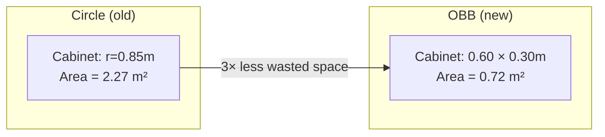

# Placement Algorithm Redesign: Bounding Boxes + Continuous Zones

## Problem with the Current Approach

| Issue | Impact |
|---|---|
| **Circles waste space** | A 1.2m × 0.4m desk uses a 1.2m-radius circle — wastes ~70% of the reserved area. Nearby objects are rejected even when they'd physically fit. |
| **Predefined slots limit variety** | Only 10 wall slots and 12 room slots → limited placement diversity. The same positions appear repeatedly across rooms. |
| **Only 3/8 wall props fit** | Because circle envelopes are too large and slots are too close, most props fail the overlap check. |

## New Approach: OBB + Continuous Zones

### 1. Oriented Bounding Boxes (OBB)

Replace circles with axis-aligned rectangles rotated by the object's yaw:

```
Current:  PropMeta(spacing_radius=0.85)     → circle of radius 0.85
New:      PropBox(half_w=0.60, half_d=0.30) → 1.2m × 0.6m rectangle
```

Each object gets a **2D bounding box** defined by `(center_x, center_y, half_width, half_depth, yaw_rad)`. Collision detection uses the **Separating Axis Theorem (SAT)**:

- For two OBBs, project both onto 4 axes (2 edge normals per box).
- If projections overlap on **all 4 axes** → collision.
- If any axis has a gap → no collision.

This is exact, tight, and well-suited for rectangular furniture.



### 2. Continuous Placement Zones (No Slots)

Instead of picking from a fixed list of (x, y) positions, objects sample from continuous **placement zones**:

#### Wall zones (strips along walls)

```
Back wall zone:   x ∈ [ROOM_X_MIN + margin, RIGHT_WALL_LINE_X - corner_margin]
                  y = BACK_WALL_LINE_Y + wall_offset  (fixed — flush to wall)
                  yaw = face-into-room yaw for this wall

Right wall zone:  x = RIGHT_WALL_LINE_X - wall_offset  (fixed — flush to wall)
                  y ∈ [BACK_WALL_LINE_Y + corner_margin, ROOM_Y_MAX - margin]
                  yaw = face-into-room yaw for this wall
```

Wall props sample a **random position along the wall strip** (1 degree of freedom per wall), then check OBB overlap with already-placed props. This gives continuous variation instead of snapping to 10 fixed points.

Each wall prop also randomly chooses **which wall** to go on (back or right), weighted by available space.

#### Room interior zone (for the table group)

The table group (desk + chair + robot) samples from the full room interior:

```
x ∈ [ROOM_X_MIN + desk_margin, ROOM_X_MAX - desk_margin]
y ∈ [ROOM_Y_MIN + desk_margin, ROOM_Y_MAX - desk_margin]
yaw ∈ [0, 2π)  — fully continuous
```

No predefined slots. Pure rejection sampling against the wall props' bounding boxes.

#### Desk surface zone (unchanged)

Already uses continuous sampling — just switch the collision check from circles to small OBBs.

---

## Proposed Changes

### Constants & Metadata

#### [MODIFY] [constants.py](file:///Users/cezarioa/Documents/room_randomizer_lab/constants.py)

**Delete:**
- `PlacementSlot` dataclass
- `WALL_PLACEMENT_SLOTS` (10 predefined slots)
- `ROOM_PROP_PLACEMENT_SLOTS` (12 predefined slots)
- `TABLE_GROUP_MAX_SLOT_TRIES`
- `DESK_RADIUS`, `CHAIR_RADIUS`, `ROBOT_RADIUS` (circles)
- `WallPropMeta.spacing_radius` field (circle-based)

**Replace with:**

```python
@dataclass(frozen=True)
class BBox:
    """2D oriented bounding box for placement collision."""
    half_w: float   # half-width  (X in local frame)
    half_d: float   # half-depth  (Y in local frame)

@dataclass(frozen=True)
class WallPropMeta:
    usd_name: str
    bbox: BBox                # replaces spacing_radius
    tall: bool = False
    wall_offset: float = 0.0  # how far from wall surface (centre-to-wall)
    yaw_offset: float = 0.0   # yaw adjustment relative to wall normal
    allowed_walls: tuple[str, ...] = ("back", "right")

@dataclass(frozen=True)
class TablePropMeta:
    bbox: BBox                # replaces radius
```

**Add wall zone definitions:**

```python
# Wall zone: continuous strip where wall props can be placed
@dataclass(frozen=True)
class WallZone:
    wall: str           # "back" or "right"
    sample_min: float   # min of the free axis
    sample_max: float   # max of the free axis
    fixed_coord: float  # the fixed axis value (prop centre distance from wall)
    base_yaw: float     # yaw to face into the room (radians)

WALL_ZONES = [
    WallZone("back",  sample_min=-12.0, sample_max=-4.0,
             fixed_coord=-10.3, base_yaw=0.0),
    WallZone("right", sample_min=-9.5,  sample_max=-5.5,
             fixed_coord=-3.0,  base_yaw=math.pi/2),
]
```

> [!IMPORTANT]
> The `fixed_coord` values (wall-parallel position) and `sample_min/max` ranges should be tuned to your actual room geometry. The values above are estimates from the current slot positions.

---

### Collision Engine

#### [MODIFY] [placement_utils.py](file:///Users/cezarioa/Documents/room_randomizer_lab/placement_utils.py)

**Delete:**
- `is_free_batched` (circle-based)
- `table_group_fits_batched` (circle-based)
- `point_inside_room_batched` (radius-based)
- `tall_prop_corner_ok` (slot-based)
- `wall_yaw_for_prop` (slot-based yaw lookup)

**Add:**

```python
def obb_corners(cx, cy, hw, hd, yaw):
    """Compute the 4 corners of an oriented bounding box."""
    ...

def obb_overlap(box_a, box_b) -> bool:
    """SAT-based overlap test between two oriented bounding boxes."""
    ...

def obb_inside_room(cx, cy, hw, hd, yaw) -> bool:
    """Check all 4 corners of an OBB are inside the room bounds."""
    ...

def obb_overlap_any(candidate_obb, placed_obbs) -> bool:
    """Check if a candidate OBB overlaps any already-placed OBB."""
    ...
```

**Keep (unchanged):**
- `yaw_to_quat`
- `offset_from_yaw_batched`
- `local_to_world_xy`
- `build_root_state`

---

### Event Terms

#### [MODIFY] [room_events.py](file:///Users/cezarioa/Documents/room_randomizer_lab/room_events.py)

**Phase 1 (`_place_wall_props`) — rewritten:**
1. For each wall prop, randomly choose a wall (back or right).
2. Sample a random position along that wall's continuous zone strip.
3. Compute the OBB at that position (using the prop's `bbox` + wall yaw).
4. Check OBB doesn't overlap any already-placed OBB.
5. Check OBB corners are all inside room bounds.
6. If it fails, try the other wall, then retry with new random positions.

**Phase 2 (`_place_table_group`) — rewritten:**
1. Sample random `(x, y, yaw)` from the full room interior.
2. Compute OBBs for desk, chair, and robot at their orbital positions.
3. Check none of the 3 OBBs overlap each other or any wall prop OBB.
4. Check all OBB corners are inside room bounds.
5. Repeat rejection sampling until valid or fallback.

**Phase 3 (`_place_desk_objects`) — minor update:**
- Replace circle overlap check with OBB overlap check on the desk surface.

---

### Test Script

#### [MODIFY] [test_placement.py](file:///Users/cezarioa/Documents/room_randomizer_lab/test_placement.py)

Update to draw rectangles instead of circles. Show OBBs with proper rotation.

---

## Object Bounding Box Dimensions

> [!IMPORTANT]
> These are estimates based on the USD asset names. You should verify/adjust them by inspecting the actual meshes in Isaac Sim (select object → check Transform extent in Properties panel).

| Object | `half_w` (m) | `half_d` (m) | Notes |
|---|---|---|---|
| SM_MedicalCabinet_01a | 0.45 | 0.25 | Tall, ~0.9m × 0.5m footprint |
| SM_ShelfSet_01a | 0.50 | 0.25 | Tall, ~1.0m × 0.5m |
| SM_SupplyCabinet_01c | 0.40 | 0.25 | Tall, ~0.8m × 0.5m |
| SM_SupplyCart_02a | 0.40 | 0.30 | ~0.8m × 0.6m |
| SM_SupplyCart_03a | 0.40 | 0.30 | ~0.8m × 0.6m |
| SM_TrashCan | 0.20 | 0.20 | ~0.4m × 0.4m (roughly square) |
| SM_Plant01 | 0.25 | 0.25 | ~0.5m × 0.5m |
| SM_Plant02 | 0.25 | 0.25 | ~0.5m × 0.5m |
| SM_Desk_04a | 0.60 | 0.40 | ~1.2m × 0.8m |
| SM_Chair_04a | 0.30 | 0.30 | ~0.6m × 0.6m |
| ridgeback_03 | 0.50 | 0.35 | ~1.0m × 0.7m |
| SM_CoffeeToGo | 0.05 | 0.05 | Tiny |
| SM_Lamp02 | 0.10 | 0.10 | Small base |
| SM_BoxPortableC | 0.10 | 0.08 | Small box |

---

## Benefits

| Metric | Old (circles + slots) | New (OBB + zones) |
|---|---|---|
| Wall prop placements per room | ~3/8 | **~6–8/8** (tighter boxes = more fit) |
| Position variety | 10 fixed wall positions | **Continuous** along wall strips |
| Desk position variety | 12 fixed positions | **Continuous** in room interior |
| Collision accuracy | ~30% wasted space | **<5% wasted** (tight rectangles) |
| Code complexity | Moderate | Slightly higher (SAT math), but cleaner (no slot lists) |

---

## Verification Plan

### Automated Tests
- `python test_placement.py` — generate 6 rooms, visualize OBBs as rotated rectangles
- Verify all OBB corners are inside room bounds
- Verify no OBB pairs overlap (SAT check all-vs-all)
- Count placed wall props per room (target: ≥ 6/8)

### Manual Verification
- Run in Isaac Lab viewer and watch resets
- Inspect that furniture doesn't clip through walls or each other
