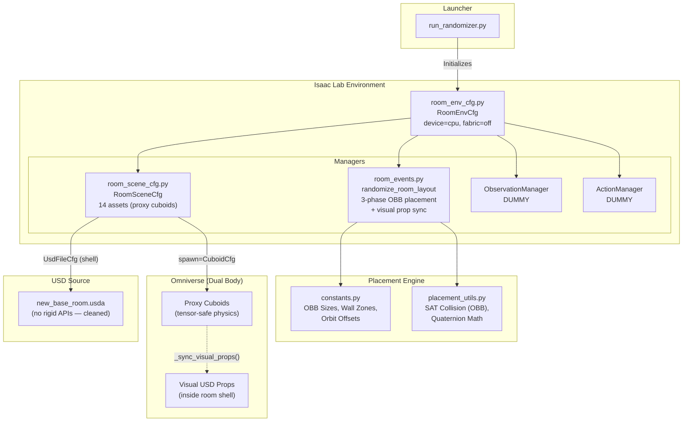
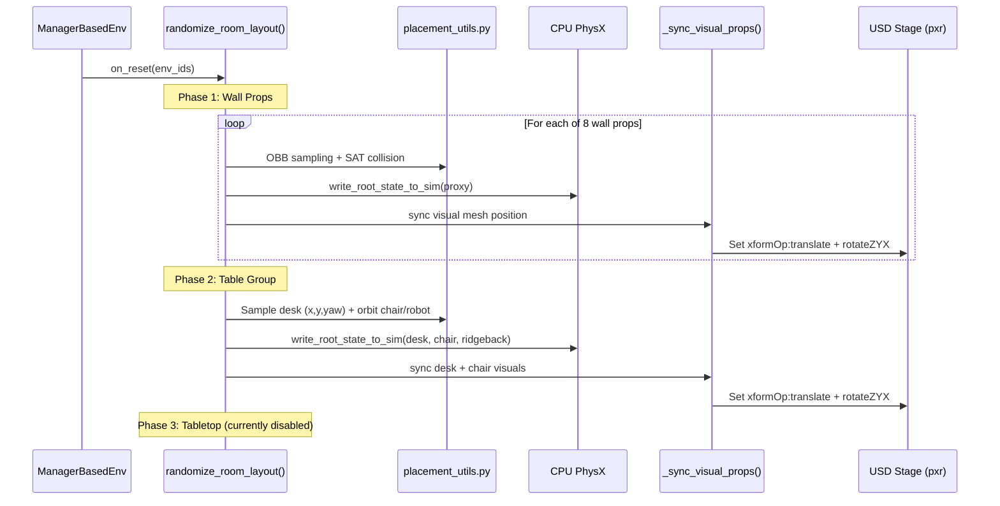

# Project Architecture & Roadmap

This document provides a high-level overview of the `room_randomizer_lab` project as it currently stands, and outlines the missing pieces required to turn this from a "randomizing simulation" into a fully functional Reinforcement Learning (RL) training environment.

> **Last updated:** 2026-06-19 | **Post PhysX-fix architecture (dual-body proxies + visual sync)**

## 1. Ensemble Picture (Current Architecture)

The system is built using Isaac Lab's declarative `ManagerBasedEnv` framework. The core responsibility of the current codebase is **domain randomization** (resetting the environment into a new, collision-free state at the start of every episode).

### Dual-Body Architecture

The environment uses a **proxy + visual** pattern to work around PhysX GPU tensor view limitations:

- **Physics proxies** are invisible `CuboidCfg` cuboids spawned at clean prim paths (e.g., `{ENV}/desk_proxy`). These are the objects Isaac Lab's tensor views control. They have `rigid_body_enabled=True`, gravity disabled, and high damping.
- **Visual props** are the detailed furniture meshes already present in the `new_base_room.usda` shell. After each reset, `_sync_visual_props()` moves these USD prims to match the proxy positions via direct `pxr` API calls.
- **CPU PhysX** is forced (`sim.device = "cpu"`, `sim.use_fabric = False`) because GPU tensor views still crash with this scene configuration.

### Module Breakdown

| Module | Responsibility |
|--------|---------------|
| [constants.py](file:///Users/cezarioa/Projects/isaac-projects/room_randomizer_lab/constants.py) | Room geometry, OBB sizes (`BBox`), wall zone definitions (`WallZone`), wall prop metadata (`WallPropMeta`), tabletop prop metadata, orbit offsets, asset USD paths |
| [placement_utils.py](file:///Users/cezarioa/Projects/isaac-projects/room_randomizer_lab/placement_utils.py) | Pure math: SAT collision (`obb_overlap`), room bounds check (`obb_inside_room`), yaw-to-quaternion (`yaw_to_quat`), coordinate transforms (`offset_from_yaw`, `build_root_state`) |
| [room_scene_cfg.py](file:///Users/cezarioa/Projects/isaac-projects/room_randomizer_lab/room_scene_cfg.py) | Isaac Lab scene definition. Maps Python config to USD + proxy cuboids. Helper factories: `_kinematic_usd_cfg`, `_dynamic_usd_cfg`, `_proxy_box_cfg` |
| [room_events.py](file:///Users/cezarioa/Projects/isaac-projects/room_randomizer_lab/room_events.py) | The "Director". On reset: runs 3-phase OBB placement, writes physics state, syncs visual props via `pxr` API |
| [room_env_cfg.py](file:///Users/cezarioa/Projects/isaac-projects/room_randomizer_lab/room_env_cfg.py) | Master configuration tying Scene + Events + sim settings. Forces CPU PhysX and Fabric off. |
| [run_randomizer.py](file:///Users/cezarioa/Projects/isaac-projects/room_randomizer_lab/run_randomizer.py) | Executable launcher. Boots Isaac Sim, injects dummy managers, runs reset/step loop. |
| [test_placement.py](file:///Users/cezarioa/Projects/isaac-projects/room_randomizer_lab/test_placement.py) | Standalone test (no Isaac Sim). Runs 6 room randomizations with matplotlib OBB visualization. |

### Asset Summary

| Category | Count | Spawn Type | Notes |
|----------|------:|------------|-------|
| Static (ground, light, room shell) | 3 | GroundPlane / DomeLight / UsdFile | Room shell is the cleaned `new_base_room.usda` |
| Table group (desk, chair, ridgeback) | 3 | Proxy cuboids (`CuboidCfg`) | Ridgeback proxy is visible (dark blue), desk/chair invisible |
| Wall props | 8 | Proxy cuboids (`CuboidCfg`) | All invisible, visual sync moves USD meshes |
| Camera | 1 | PinholeCamera | Top-down view for debugging |
| **Total scene fields** | **15** | | |

> [!NOTE]
> Tabletop objects (coffee cup, desk lamp, box portable) are defined in `constants.py` but are **currently disabled** in the event config (`table_prop_names = []`) and have **no scene config fields**. They were removed during the proxy cuboid migration.

---

## 2. What Is Left for Full RL Functionality?

The environment perfectly randomizes the room layout, but the "Agent" (the Ridgeback robot) has no brain, no eyes, and no muscles. To use this for Reinforcement Learning (RL), you need to implement the following:

### A. Action Manager (Muscles)
Currently, the environment uses a dummy action space. You need to configure how the RL agent controls the Ridgeback robot.
* **Task:** Define the `ActionManagerCfg` in `room_env_cfg.py`.
* **Implementation:** Usually a `DifferentialDriveActionCfg` or `JointVelocityActionCfg` targeting the wheel joints of the Ridgeback articulation.
* **Note:** The current Ridgeback is a proxy cuboid, not an articulation. You'll need to either replace it with an `ArticulationCfg` or use force-based control on the rigid body.

### B. Observation Manager (Eyes)
Currently, the environment returns a dummy observation. The RL agent needs to know its state to make decisions.
* **Task:** Define the `ObservationManagerCfg` in `room_env_cfg.py`.
* **Implementation:** Add observation terms:
  * Proprioception: The robot's current velocity.
  * State: The robot's position and heading.
  * Task: Relative distance/vector to the target.
  * Exteroception: (Optional) 2D Lidar or camera data for vision-based navigation.

### C. Reward Manager (Motivation)
RL agents learn via rewards and penalties. This is currently missing.
* **Task:** Define a `RewardManagerCfg`.
* **Implementation:** Reward terms such as:
  * Progress reward for moving closer to target.
  * Success reward for reaching the desk.
  * Collision penalty for hitting wall props or chair.
  * Time penalty to encourage efficiency.

### D. Termination Manager (Episode Rules)
The simulation needs to know when an episode is "over" so it can trigger the `randomize_room_layout` event again.
* **Task:** Define a `TerminationManagerCfg`.
* **Implementation:**
  * Terminate on reaching the desk.
  * Terminate on max time limit (e.g., 500 steps).
  * Terminate on collision or out-of-bounds.

### E. RL Wrapper & Training Loop
Once the environment has Actions, Observations, and Rewards, connect it to an RL library.
* **Task:** Create a `train.py` script.
* **Implementation:** Use `skrl` or `rsl_rl`. Wrap the Isaac Lab environment with their vector env wrappers and run PPO training.

### F. GPU PhysX Investigation
* **Task:** Investigate why proxy cuboids still crash on GPU PhysX.
* **Impact:** Moving from CPU to GPU PhysX would give ~10× speedup for large `num_envs`, critical for RL training at scale.

### G. Re-enable Tabletop Objects
* **Task:** Add `RigidObjectCfg` fields for coffee_cup, desk_lamp, box_portable back to `RoomSceneCfg`.
* **Implementation:** Use `_proxy_box_cfg()` or `_dynamic_usd_cfg()` and re-add names to `table_prop_names` in `RoomEventCfg`.

---

## 3. Data Flow on Reset

