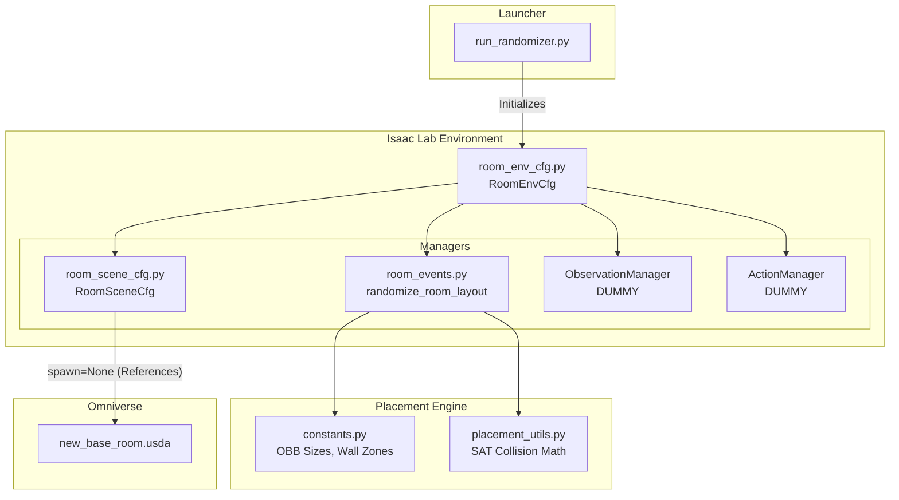

# Project Architecture & Roadmap

This document provides a high-level overview of the `room_randomizer_lab` project as it currently stands, and outlines the missing pieces required to turn this from a "randomizing simulation" into a fully functional Reinforcement Learning (RL) training environment.

## 1. Ensemble Picture (Current Architecture)

The system is built using Isaac Lab's declarative `ManagerBasedEnv` framework. The core responsibility of the current codebase is **domain randomization** (resetting the environment into a new, collision-free state at the start of every episode).

### Module Breakdown:
* **`constants.py`**: Defines the physical sizes of objects (Oriented Bounding Boxes) and the boundaries of the continuous wall zones.
* **`placement_utils.py`**: Pure mathematics. Handles the Separating Axis Theorem (SAT) for overlap checks, quaternion conversions, and boundary checks.
* **`room_scene_cfg.py`**: Maps the python code to the actual USD file. It tells Isaac Lab where to find the desk, chair, and robot in `new_base_room.usda`.
* **`room_events.py`**: The "Director". When the environment resets, this script runs the 3-phase OBB placement algorithm and teleports the physics bodies.
* **`room_env_cfg.py`**: The master configuration that ties the Scene and Events together.
* **`run_randomizer.py`**: The executable script that boots up the simulation window.

---

## 2. What is left to be fully functional?

Right now, the environment perfectly randomizes the room, but the "Agent" (the Ridgeback robot) has no brain, no eyes, and no muscles. To use this for Reinforcement Learning (RL), you need to implement the following managers in `room_env_cfg.py`.

### A. Action Manager (Muscles)
Currently, the environment uses a dummy action space. You need to configure how the RL agent controls the Ridgeback robot.
* **Task:** Define the `ActionManagerCfg` in `room_env_cfg.py`.
* **Implementation:** Usually a `DifferentialDriveActionCfg` or `JointVelocityActionCfg` targeting the wheel joints of the Ridgeback articulation.

### B. Observation Manager (Eyes)
Currently, the environment returns a dummy observation. The RL agent needs to know its state to make decisions.
* **Task:** Define the `ObservationManagerCfg` in `room_env_cfg.py`.
* **Implementation:** You need to add observation terms. For example:
  * Proprioception: The robot's current joint velocities.
  * State: The robot's position and heading.
  * Task: The relative distance/vector to the target (e.g., the desk or a specific coordinate).
  * Exteroception: (Optional) 2D Lidar or camera data if you are doing vision-based navigation.

### C. Reward Manager (Motivation)
RL agents learn via rewards and penalties. This is currently missing.
* **Task:** Define a `RewardManagerCfg`.
* **Implementation:** Add reward terms such as:
  * Positive reward for moving closer to the target (progress reward).
  * Large positive reward for reaching the desk.
  * Negative penalty (cost) for colliding with wall props or the chair.
  * Small negative penalty (time penalty) to encourage moving quickly.

### D. Termination Manager (Episode Rules)
The simulation needs to know when an episode is "over" so it can trigger the `randomize_room_layout` event again.
* **Task:** Define a `TerminationManagerCfg`.
* **Implementation:**
  * Terminate when the robot successfully reaches the desk.
  * Terminate when a maximum time limit (e.g., 500 steps) is reached.
  * Terminate if the robot crashes into a wall or flips over.

### E. RL Wrapper & Training Loop
Once the environment has Actions, Observations, and Rewards, you need to connect it to an RL library.
* **Task:** Create a `train.py` script.
* **Implementation:** Use a library like `skrl` or `rsl_rl`. You will wrap the Isaac Lab environment using their provided wrappers (e.g., `SkrlVecEnvWrapper`) and start the PPO training loop.

### F. Manual Physics Setup (Crucial!)
* **Task:** Open `new_base_room.usda` in the Isaac Sim UI.
* **Implementation:** Ensure that all props (desk, chair, cabinets, robot) have the **Rigid Body with Colliders Preset** applied. If they are just static meshes, Isaac Lab cannot move them or detect collisions during the RL simulation.
