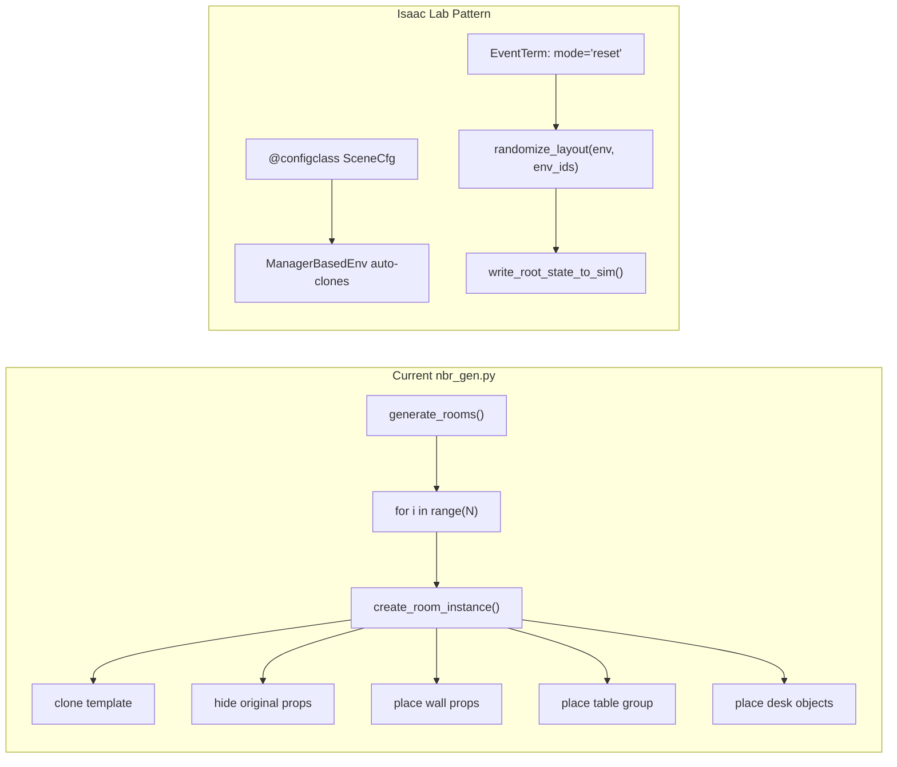

# Transition Guide: `nbr_gen.py` → Isaac Lab `ManagerBasedEnv`

> [!NOTE]
> This document maps every element of the current procedural script to the Isaac Lab declarative pattern. Read it as a "before/after" reference, not an implementation plan.

---

## 1. The Fundamental Architecture Shift

Your current script and the Isaac Lab example solve the same problem — "create N environments with randomized object placement" — but with opposite control flow:

| Aspect | Current `nbr_gen.py` | Isaac Lab `ManagerBasedEnv` |
|---|---|---|
| **Scene creation** | Imperative: `define_xform()`, `add_payload_prim()`, `set_xform()` | Declarative: `@configclass` with typed asset configs |
| **Environment cloning** | Manual: grid loop with `ROOM_SPACING_X/Y`, internal USD references | Automatic: `num_envs=N`, `env_spacing=3.0`, `{ENV_REGEX_NS}` path token |
| **Randomization timing** | Once at build: baked into USD transforms | Every reset: event term function re-runs, writes new state to sim |
| **Math backend** | Python `random` + scalar math, sequential | `torch` tensors, **all envs in parallel** |
| **State representation** | USD xformOps (translate + rotateXYZ + scale) | Root state tensor: `(N, 13)` = pos(3) + quat(4) + lin_vel(3) + ang_vel(3) |
| **Coordinate frame** | World-space with manual room offsets | Local-space; `env.scene.env_origins` provides per-env offsets |
| **USD interaction** | Direct: `pxr` API, `omni.usd` | Abstracted: Isaac Lab manages USD lifecycle internally |



---

## 2. Component-by-Component Mapping

### 2.1 Scene Definition

**Current:** The room structure comes from an existing `/World/Environment` USD prim that's cloned via internal references. Props are loaded with `add_payload_prim()` from S3 URLs.

**Isaac Lab:** Each object is a named field in an `InteractiveSceneCfg` dataclass. The room itself becomes a `UsdFileCfg` asset, and each prop is its own `RigidObjectCfg`.

```python
# CURRENT (imperative)
add_payload_prim(
    f"{props_root}/wall_props/SM_MedicalCabinet_01a",
    "https://...SM_MedicalCabinet_01a.usd",
    translate=(-3.0, -10.0, 0.0),
    yaw_deg=90.0,
)

# ISAAC LAB (declarative)
@configclass
class RoomSceneCfg(InteractiveSceneCfg):
    medical_cabinet = RigidObjectCfg(
        prim_path="{ENV_REGEX_NS}/WallProps/SM_MedicalCabinet_01a",
        spawn=sim_utils.UsdFileCfg(
            usd_path="https://...SM_MedicalCabinet_01a.usd",
            rigid_props=sim_utils.RigidBodyPropertiesCfg(kinematic_enabled=True),
            collision_props=sim_utils.CollisionPropertiesCfg(),
        ),
        init_state=RigidObjectCfg.InitialStateCfg(pos=(-3.0, -10.0, 0.0)),
    )
```

> [!IMPORTANT]
> **Key decision:** Each prop that needs independent randomization must be a **separate named field** in the scene config. You can't just loop and `add_payload_prim` dynamically — the scene structure is fixed at config time.

**What this means for your 8 wall props + 3 table objects + desk + chair + robot:**

| Current Object | Scene Cfg Field | Asset Type |
|---|---|---|
| Room structure (`/World/Environment`) | `room_structure` | `AssetBaseCfg` with `UsdFileCfg` (static) |
| Ground/lights | `ground`, `light` | `AssetBaseCfg` with `GroundPlaneCfg` / `DomeLightCfg` |
| SM_Desk_04a | `desk` | `RigidObjectCfg` (kinematic) |
| SM_Chair_04a | `chair` | `RigidObjectCfg` (kinematic) |
| ridgeback_03 | `ridgeback` | `RigidObjectCfg` (kinematic) |
| SM_MedicalCabinet_01a | `medical_cabinet` | `RigidObjectCfg` (kinematic) |
| SM_ShelfSet_01a | `shelf_set` | `RigidObjectCfg` (kinematic) |
| SM_SupplyCabinet_01c | `supply_cabinet` | `RigidObjectCfg` (kinematic) |
| SM_SupplyCart_02a | `supply_cart_a` | `RigidObjectCfg` (kinematic) |
| SM_SupplyCart_03a | `supply_cart_b` | `RigidObjectCfg` (kinematic) |
| SM_TrashCan | `trash_can` | `RigidObjectCfg` (kinematic) |
| SM_Plant01 | `plant_a` | `RigidObjectCfg` (kinematic) |
| SM_Plant02 | `plant_b` | `RigidObjectCfg` (kinematic) |
| SM_CoffeeToGo | `coffee_cup` | `RigidObjectCfg` (dynamic) |
| SM_Lamp02 | `desk_lamp` | `RigidObjectCfg` (dynamic) |
| SM_BoxPortableC | `box_portable` | `RigidObjectCfg` (dynamic) |

That's **~16 named fields** in `RoomSceneCfg`, each with a unique `{ENV_REGEX_NS}/...` path.

---

### 2.2 Environment Cloning

**Current:** You manually compute grid positions and clone the template:

```python
# CURRENT
for i in range(room_count):
    grid_x = i % columns
    grid_y = i // columns
    create_room_instance(i + 1, grid_x, grid_y)
```

**Isaac Lab:** This entire mechanism is replaced by two numbers:

```python
scene = RoomSceneCfg(num_envs=20, env_spacing=16.0)
```

Isaac Lab automatically clones every asset defined in the scene config `num_envs` times, spaced in a grid. The `{ENV_REGEX_NS}` token in each `prim_path` gets replaced with `/World/envs/env_0`, `/World/envs/env_1`, etc.

**What you delete:** `ROOM_SPACING_X/Y`, `GENERATED_START_OFFSET`, the entire grid loop in `generate_rooms()`, `create_room_instance()`, `define_xform()`, `add_internal_reference_prim()`, `add_internal_reference_xform()`, `set_xform()`, `add_payload_prim()`, all the `hide_*` functions. Essentially **the entire USD manipulation layer**.

---

### 2.3 Randomization → Event Terms

This is the core transformation. Your current randomization runs once during construction. In Isaac Lab, it runs as a function called on every episode reset.

**Current flow in `create_room_instance()`:**
1. Shuffle wall slots → place wall props (circle-packing)
2. Choose table group position (rejection sampling) → place desk + chair + robot
3. Place tabletop objects (rejection sampling on desk surface)

**Isaac Lab equivalent:** One or more event term functions with the signature:

```python
def randomize_room_layout(
    env: ManagerBasedEnv,
    env_ids: torch.Tensor,     # which envs are resetting (could be a subset!)
    wall_props: list[str],     # scene config field names
    room_props: list[str],
    table_props: list[str],
    ...
):
```

> [!IMPORTANT]
> The biggest change: **all envs are randomized in parallel**, not sequentially. Your rejection-sampling loops must operate on tensors of shape `(num_envs, ...)`, with a `remaining` mask to track which envs still need a valid placement. See how the tray example does this with `remaining = torch.ones(num_envs, dtype=torch.bool)`.

#### What carries over vs. what gets rewritten:

| Current Logic | Keeps? | Notes |
|---|---|---|
| `PlacementSlot` data | ✅ Keep as constants | Slot positions, radii, wall tags — these become tensors |
| `WALL_PROP_YAW_BY_WALL` | ✅ Keep as constants | Yaw lookup stays the same |
| `PropSpec` | ⚠️ Partially | `spacing_radius`, `tall`, `radius` still useful. `asset_path` moves to the scene config. |
| `is_free()` circle-packing | 🔄 Rewrite | Must become a batched `torch` function operating on `(N, 2)` tensors |
| `choose_wall_slot()` | 🔄 Rewrite | Rejection sampling becomes parallel across envs |
| `table_group_fits()` | 🔄 Rewrite | Same — batched version |
| `offset_from_pose()` | 🔄 Rewrite | `torch.cos` / `torch.sin` instead of `math.cos` / `math.sin` |
| `random_desk_object_pose()` | 🔄 Rewrite | `torch.rand` instead of `random.uniform` |
| `wall_yaw_for_prop()` | ✅ Keep | Pure data lookup, doesn't need tensors |
| All USD helpers (`define_xform`, etc.) | ❌ Delete | Isaac Lab handles all prim creation internally |
| `build_ui()` / `main()` | ❌ Delete | Isaac Lab provides its own app runner |

---

### 2.4 State Writing: `set_xform` → `write_root_state_to_sim`

**Current:** You set transforms via USD xformOps:
```python
set_xform(path, translate=(x, y, z), yaw_deg=90.0)
```

**Isaac Lab:** You write a `(N, 13)` tensor per asset:
```python
root_state = asset.data.default_root_state[env_ids].clone()
root_state[:, 0] = x + env.scene.env_origins[env_ids, 0]  # world x
root_state[:, 1] = y + env.scene.env_origins[env_ids, 1]  # world y
root_state[:, 2] = z + env.scene.env_origins[env_ids, 2]  # world z
# quaternion for yaw-only rotation:
root_state[:, 3] = torch.cos(yaw_rad * 0.5)  # qw
root_state[:, 4] = 0.0                         # qx
root_state[:, 5] = 0.0                         # qy
root_state[:, 6] = torch.sin(yaw_rad * 0.5)   # qz
root_state[:, 7:] = 0.0                        # zero velocities

asset.write_root_state_to_sim(root_state, env_ids=env_ids)
```

> [!WARNING]
> **Euler → Quaternion:** Your current code uses `yaw_deg` everywhere. Isaac Lab uses quaternions `(qw, qx, qy, qz)`. For Z-up yaw-only rotations, the conversion is simple (see above), but be careful if you ever add pitch/roll.

> [!WARNING]
> **`env_origins` offset:** Every coordinate you write must be in **world space**, which means adding `env.scene.env_origins[env_ids]`. The tray example shows this pattern on every axis. Your current code uses "local to the room" coordinates — you'll need to add the env origin offset.

---

### 2.5 Coordinate System Translation

**Current:** All coordinates are in the template room's local frame (negative x, negative y):
```
ROOM_X_MIN = -13.0, ROOM_X_MAX = -1.0
ROOM_Y_MIN = -11.0, ROOM_Y_MAX = -5.0
```

**Isaac Lab:** Environments are centered at their `env_origin`, so you'd typically re-center. You have two choices:

1. **Re-center coordinates to (0, 0):** Shift all slot positions, room bounds, etc. by the room center (~(-7, -8)). This is cleaner but requires updating every constant.

2. **Keep original coordinates, add env_origin:** Add `env.scene.env_origins` at write time, same as the tray example. Less work upfront but means your "local" coordinates are offset from (0,0).

---

### 2.6 Dynamic Object Count Problem

Your current script varies **how many** wall props appear and **which** tabletop objects appear per room. In Isaac Lab, the scene structure is fixed — every env has the same prims.

**Solution:** Spawn all possible objects in the scene config, but "hide" unwanted ones per-env by teleporting them far below the floor:

```python
# "Despawn" an object by moving it underground
root_state[:, 2] = -100.0  # far below ground
asset.write_root_state_to_sim(root_state, env_ids=env_ids)
```

This is the standard Isaac Lab pattern for variable object counts.

---

## 3. Resulting File Structure

```
project/
├── room_scene_cfg.py        # @configclass RoomSceneCfg(InteractiveSceneCfg)
│                             #   ~16 asset fields
│
├── room_events.py            # Event term functions:
│   ├── randomize_wall_props()     # batched wall-slot assignment
│   ├── randomize_table_group()    # batched desk+chair+robot placement
│   └── randomize_desk_objects()   # batched tabletop placement
│
├── room_env_cfg.py           # @configclass RoomEnvCfg(ManagerBasedEnvCfg)
│                             #   scene, events, observations, actions
│
├── placement_utils.py        # Reusable, tensorized:
│   ├── is_free_batched()          # (N, 2) circle packing
│   ├── offset_from_pose_batched() # (N,) yaw + local offset → world
│   └── euler_to_quat_z()         # yaw_rad → (qw, qx, qy, qz)
│
└── constants.py              # Slot positions, yaw tables, radii
                              #   (carried over from nbr_gen.py)
```

---

## 4. Phased Implementation Order

### Phase 1 — Static scene (no randomization)
1. Create `RoomSceneCfg` with all assets at their default positions
2. Load the room environment USD as a static `AssetBaseCfg`
3. Verify it renders correctly with `num_envs=1`
4. Scale to `num_envs=4` and confirm auto-cloning

### Phase 2 — Table group randomization
1. Port `offset_from_pose` → `offset_from_pose_batched` (torch)
2. Port `table_group_fits` → batched rejection sampling
3. Write `randomize_table_group()` event term
4. Verify desk + chair + robot move correctly on reset

### Phase 3 — Wall prop randomization
1. Port `is_free` → `is_free_batched`
2. Port the slot-selection + tall-prop logic
3. Write `randomize_wall_props()` event term
4. Handle "unused props go underground" for variable counts

### Phase 4 — Tabletop objects
1. Port `random_desk_object_pose` → batched version
2. Write `randomize_desk_objects()` event term
3. Handle the "2 or 3 objects" variation (underground trick)

### Phase 5 — Polish
1. Add observation/action managers if this feeds into RL
2. Add camera randomization (Tier 2 from your spec)
3. Add lighting randomization

---

## 5. Open Questions

> [!IMPORTANT]
> **Room shell loading:** Your current room (`/World/Environment`) contains walls, floor, ceiling, and the original authored props (which you then hide). In Isaac Lab, do you load this entire USD file as a single static `AssetBaseCfg` and hide the original props at the USD level before loading? Or do you strip the authored props from the template USD first and load a "clean shell"?

> [!IMPORTANT]
> **Kinematic vs. dynamic:** Most of your objects (wall cabinets, shelves, desk, chair) are furniture that doesn't move during simulation. Making them `kinematic_enabled=True` avoids physics simulation cost. Only the tabletop objects (coffee, lamp, box) and potentially the Ridgeback need to be dynamic. Is that correct?

> [!IMPORTANT]
> **USD file hosting:** Your current asset paths point to the Omniverse S3 CDN. Isaac Lab's `UsdFileCfg` supports the same URLs, but for training at scale you may want local copies. What's your asset distribution strategy?

> [!IMPORTANT]
> **Is this for RL training or data generation?** If it's purely for synthetic data generation (perception training from your spec), you might prefer Isaac Lab's `Replicator` integration over `ManagerBasedEnv`. If it's for RL policy training (pick-and-place), then `ManagerBasedEnv` is the right choice. Which pipeline is this feeding?
